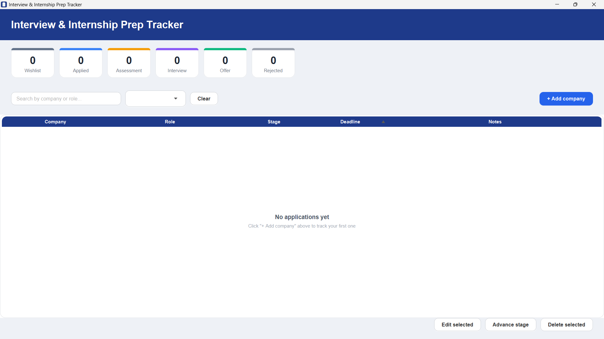
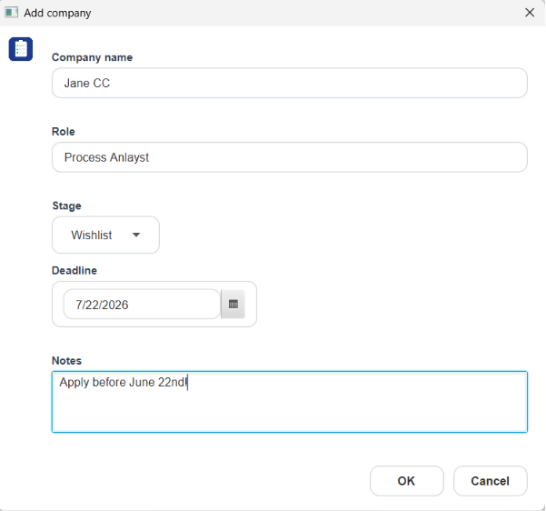
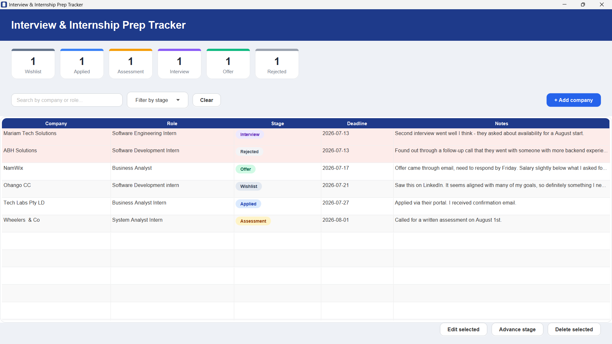
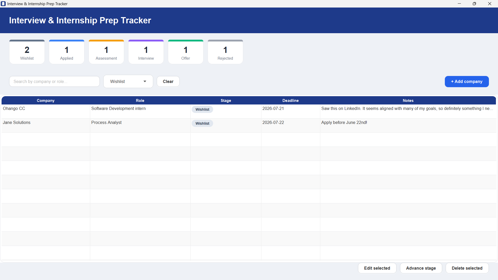
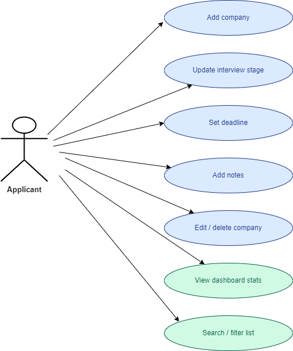
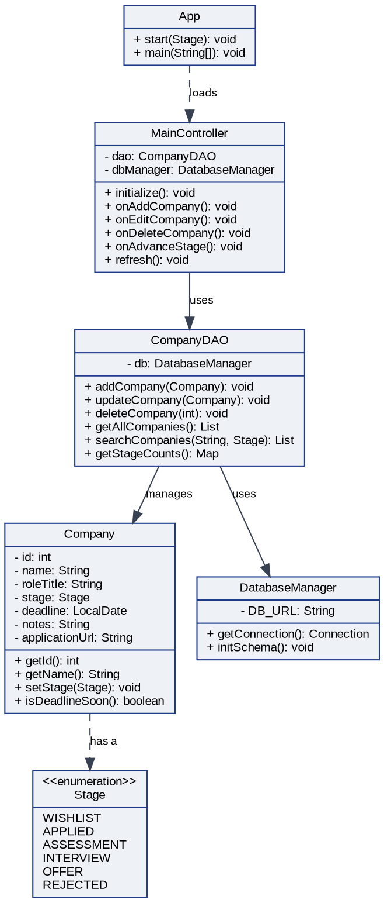

# Interview & Internship Prep Tracker

A little desktop app I built to keep track of internship applications - what stage each one's at, when things are due, and notes on interviews. Built with JavaFX and SQLite.

## Why I made this

I was tracking applications in a spreadsheet and it got messy fast, especially once I had more than a few going at once and kept losing track of deadlines. Wanted something with an actual UI and a real database instead of just rows and columns.

## What it does

- Add, edit, delete companies/roles
- Move an application through stages: Wishlist, Applied, Assessment, Interview, Offer, Rejected
- Set a deadline and it'll highlight anything due in the next 3 days
- Notes field for interviewer names, questions asked, whatever
- Search and filter by stage
- Dashboard up top shows how many applications are at each stage
- Won't let you save a company without a name/role, and won't let you set a deadline in the past
- Everything saves locally in a SQLite file, no login or internet needed

## Screenshots

Empty state, before adding anything:



Adding a company:



Main window with a few applications tracked:



Filtering by stage:



## Diagrams

Use case diagram (made in draw.io, source file is in docs/ if you want to edit it):



Class diagram (made in Lucidchart):



User stories are in `docs/user-stories.md` if you're curious what this was actually built against.

## Running it

You need JDK 17+ and Maven installed.

```bash
mvn clean javafx:run
```

First time you run it, it'll make a `data` folder and set up the database on its own - nothing to configure.

## How it's organized

Pretty standard MVC-ish split:

- `App.java` - starts everything, shows a splash screen for a second then opens the main window
- `model/` - `Company` and `Stage` (the enum for pipeline stages)
- `dao/` - `CompanyDAO`, handles all the database queries
- `util/` - `DatabaseManager`, sets up the SQLite connection and schema
- `controller/` - `MainController`, connects the FXML UI to everything else

Built with Java 17, JavaFX for the UI, SQLite for storage, Maven to build it.

## Things I'd add if I kept working on this
- Export to CSV
- Some kind of reminder/notification for deadlines
- Attach a resume or cover letter to each application

## Author
Renate